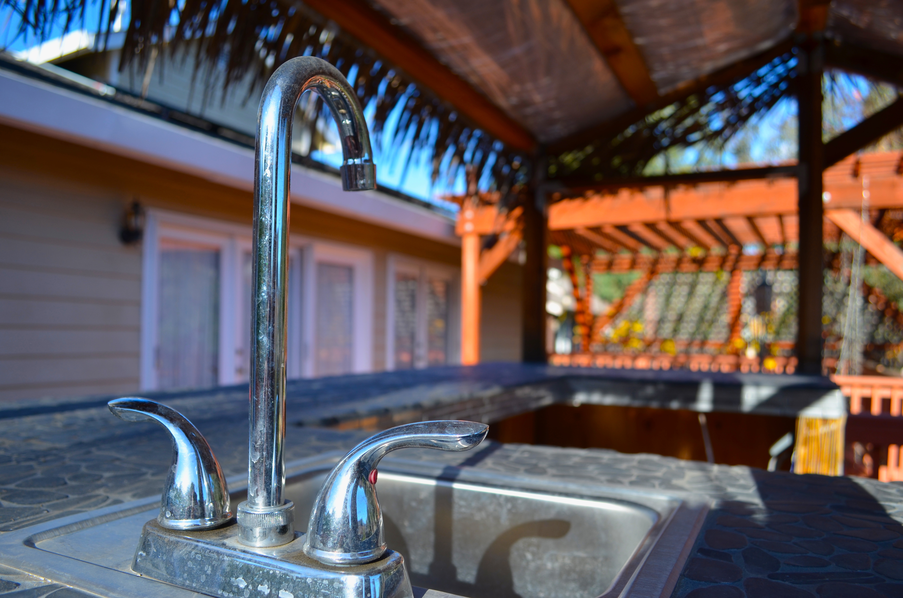
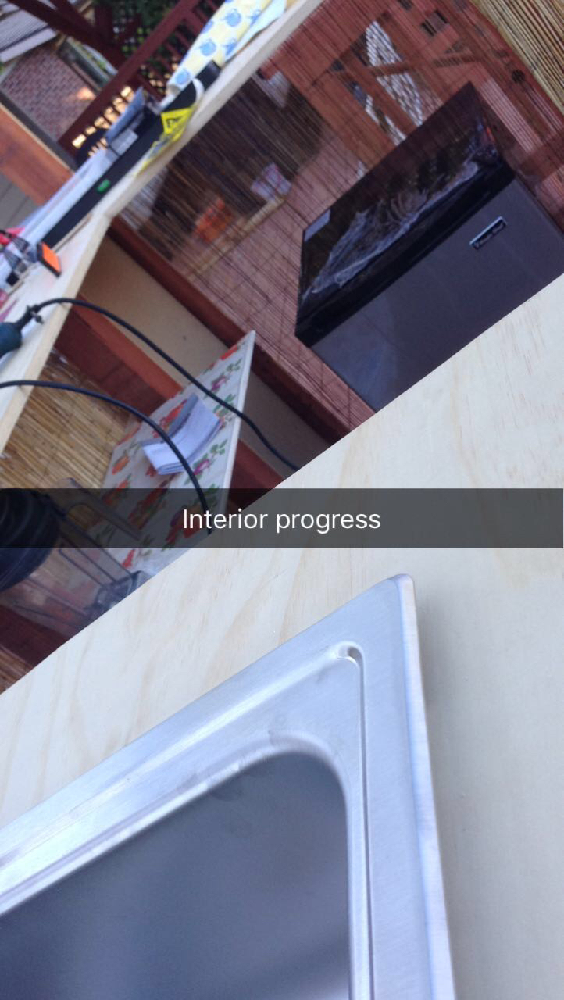
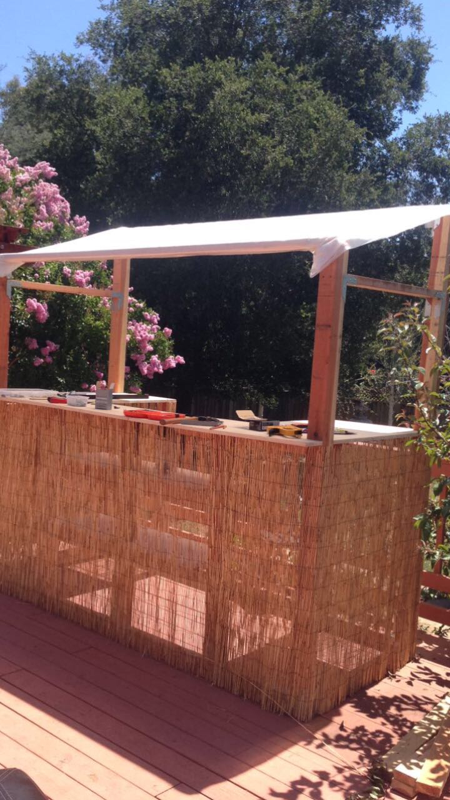

# Tiki-Bar
NOT coding-related; just a place to show pictures of an outdoor bar I built. 

# V2.0 

  
 Added corrugated roof and tiles around walls 

  
  
  
    

# V1.0 

  
  
 Finish with bamboo sheet and thatched roof 

  
  
  
  
  
  

  
  
 Building progress 

  
  
  

